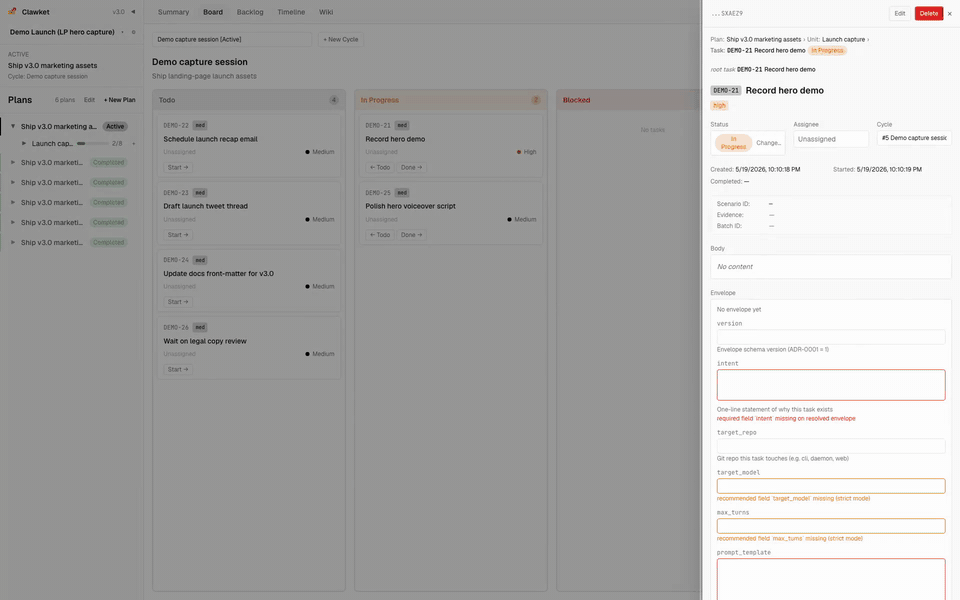
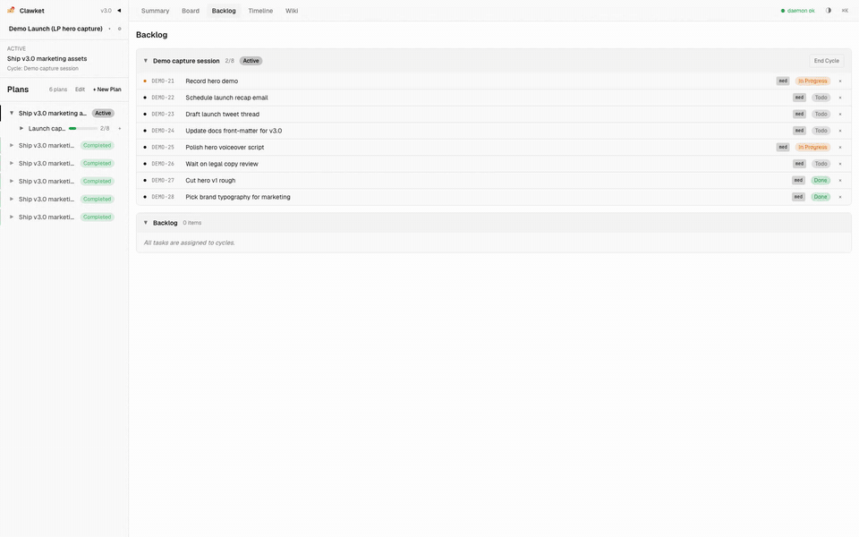
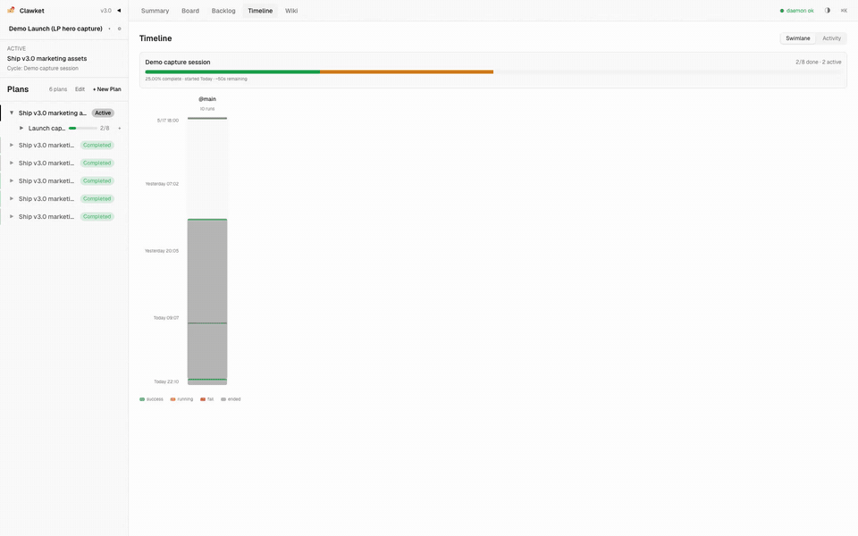
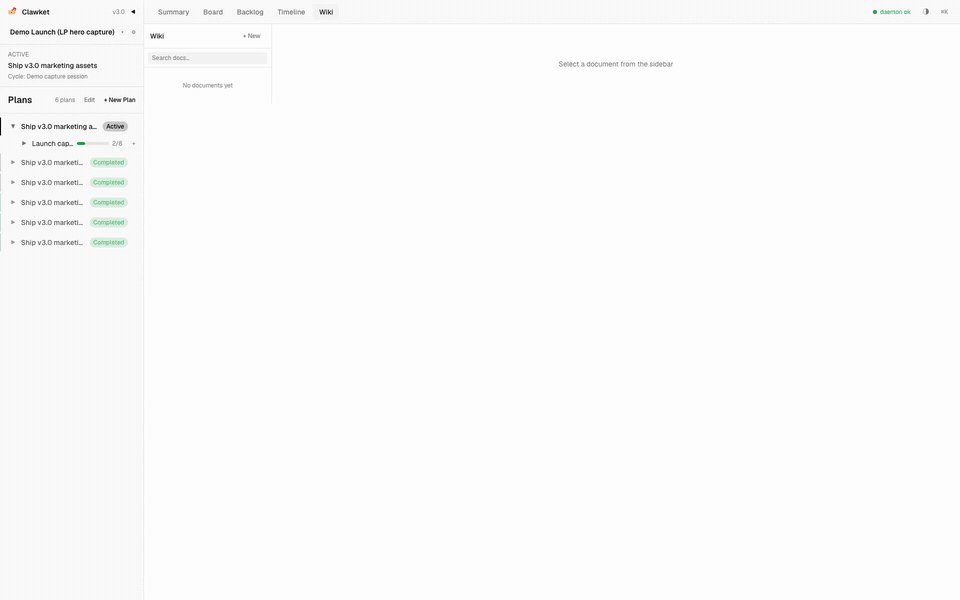

[English](README.md)

<p align="center">
  
</p>

<p align="center">LLM 코딩 에이전트를 위한 구조화된 태스크 계약.</p>

<p align="center">
  
</p>

Clawket은 LLM 기반 개발을 위한 구조화된 상태 레이어로, Jira + Confluence를 대체합니다. 프로젝트 계획, 유닛, 태스크, 산출물, 실행 이력을 로컬 SQLite + 경량 데몬으로 세션 간 영구 보존합니다. 훅 기반 가드레일이 에이전트가 등록된 태스크 없이 작업하지 못하게 보장합니다 — 모든 작업은 추적되고, 모든 세션은 컨텍스트를 가집니다.

상태 레이어 위에 **로컬 RAG 스택**(sqlite-vec + 온디바이스 임베딩)과 **MCP stdio 서버**(CLI 바이너리에 rmcp 1.5 로 내장)를 제공하므로, 외부 벡터 DB로 데이터를 내보내지 않고도 세션 간에 의미 기반 컨텍스트를 pull 할 수 있습니다.

## 왜 Clawket인가

구조화된 상태 레이어 없이 Claude Code 세션은 무상태(stateless)입니다:

- **컨텍스트 소실** — 세션이 바뀌면 처음부터 시작. "어디까지 했더라?"에 답이 없음.
- **작업 미추적** — 에이전트가 뭘 바꿨는지, 언제, 왜 바꿨는지 기록 없음.
- **플랜 노후화** — Plan Mode 파일이 `~/.claude/plans/`에 방치됨.
- **서브에이전트 단절** — 병렬 에이전트가 프로젝트 상태를 공유하지 못함.
- **과거 결정 소실** — 이전 설계 근거를 다음 세션이 떠올리지 못함.

Clawket은 영구 DB, 로컬 벡터 RAG, MCP pull 인터페이스, 런타임 어댑터, 웹 대시보드로 이 문제를 해결합니다 — 전부 로컬 실행.

## 주요 기능

- **구조화된 워크플로우** — Project → Plan (approve) → Unit → Cycle (`--unit` 필수, activate) → Task
- **라이프사이클 훅** — 6개 Claude Code 이벤트 + `PostToolUse:ExitPlanMode` matcher 가 각각 전용 핸들러에 연결됨 (SessionStart, UserPromptSubmit, PreToolUse, PostToolUse, SubagentStart, SubagentStop)
- **웹 대시보드** — 요약, 계획, 보드(칸반), 백로그, 타임라인, 위키 6개 뷰
- **에이전트 Swimlane 타임라인** — 에이전트별 수평 바 차트로 동시 작업 시각화
- **드래그 앤 드롭** — 칸반 DnD로 상태 변경, 백로그 DnD로 사이클 배정
- **위키 + 로컬 RAG** — 파일 트리 내비게이션, knowledge 버전 관리, knowledge 에 대한 FTS5 키워드 + sqlite-vec 의미 검색 하이브리드
- **자동 임베딩** — knowledge 와 모든 task 가 생성/수정 시 자동 임베딩. 데몬 startup에 누락 분 백필.
- **MCP RAG Pull** — `clawket mcp` (CLI 바이너리에 내장된 stdio 서버)가 5개 read-only tool을 Claude Code tool_use로 노출.
- **훅 가드레일** — 활성 태스크 없이 작업 불가, 세션마다 프로젝트 컨텍스트 자동 주입
- **티켓 번호** — 내부 ULID와 함께 사람이 읽을 수 있는 ID (CK-1, CK-2) + 토큰 최적화
- **CLI + Web** — LLM(CLI)과 사람(웹 UI)이 동일한 상태를 관리

### Claude 훅

[`hooks/hooks.json`](hooks/hooks.json) 의 그대로 — 6개 이벤트 + `PostToolUse:ExitPlanMode` matcher 분기.

| 이벤트 | Matcher | Handler | 용도 |
|---|---|---|---|
| **SessionStart** | `startup\|clear\|compact` | `session-start.cjs` | 데몬 기동 보장, 대시보드 + 규칙 주입, install gate 실행. |
| **UserPromptSubmit** | (all) | `user-prompt-submit.cjs` | 활성 태스크 컨텍스트 주입, 활성 태스크 없으면 경고. |
| **PreToolUse** | `Agent\|TeamCreate\|SendMessage\|Edit\|Write\|Bash` | `pre-tool-use.cjs` | 활성 태스크 없으면 변경 작업 차단. PDD anti-pattern 검사 (X3/X7/X8/X9). |
| **PostToolUse** | `Edit\|Write` | `post-tool-use.cjs` | 파일 변경을 활성 태스크에 기록. X3 scenario-id 검사. |
| **PostToolUse** | `ExitPlanMode` | `plan-sync.cjs` | Plan Mode 결과물을 Clawket plan 으로 등록하도록 안내. Claude Code 가 plan-mode 종료를 hook event 가 아닌 tool 호출로 분류하므로 `ExitPlanMode` tool matcher 로 라우팅. |
| **SubagentStart** | (all) | `subagent-start.cjs` | 서브에이전트를 배정된 태스크에 바인딩. X3/X7/X9 검사. |
| **SubagentStop** | (all) | `subagent-stop.cjs` | 결과 요약 첨부, X8 evidence 검사, 성공 시 태스크 자동 완료. |

태스크가 `done`/`cancelled` 로 전환되면 데몬이 Unit/Plan/Cycle 완료를 자동 cascade 한다 — 별도 훅이 필요하지 않다.

### 기술 스택

| 레이어 | 기술 |
|---|---|
| CLI | Rust 단일 바이너리 (`clawket` / `clawket mcp`) |
| 데몬 | Rust (axum + rusqlite), Unix socket + TCP |
| 저장소 | SQLite + sqlite-vec (vec0 virtual tables) |
| 임베딩 | `candle-core` + `paraphrase-multilingual-MiniLM-L12-v2` (384d, 온디바이스) |
| MCP | `rmcp` 1.5 stdio 서버, CLI 바이너리에 내장 |
| 웹 | React 19 + Vite + Tailwind + dnd-kit |
| 어댑터 | Claude Code plugin + hooks + skills + `.mcp.json` |

### 벤더 정책 & Tier 라우팅

Clawket v3 는 **Claude 모델 패밀리만 타겟**합니다. 태스크는 세 가지 tier 중 하나를 가지며 — `low` (Haiku 급), `med` (Sonnet 급), `high` (Opus 급) — 에이전트 spawner 가 각 태스크를 요구 tier 이상의 모델로 라우팅합니다. v3 에서 다운그레이드는 advisory (경고만), v4+ 에서 vendor-agnostic 어댑터 레이어와 함께 hard-enforce 됩니다.

전체 시맨틱과 라우팅 표: [docs/VENDOR_POLICY.md](docs/VENDOR_POLICY.md).

### 번들된 스킬 & 슬래시 명령

플러그인은 7개 스킬(`.claude-plugin/plugin.json::skillsList`) 과 6개 슬래시 명령을 등록합니다 (스킬당 1개, `clawket-dashboard` 만 슬래시 없이 대시보드 surface 로 노출):

| 스킬 | 슬래시 명령 | 용도 |
|---|---|---|
| `clawket-dashboard` | (슬래시 명령 없음) | 대시보드 surface 로 task / plan / unit / cycle 조회·갱신. |
| `clawket-plan-design` | `/clawket-plan-design` | Plan + Unit 사전 설계 — Done 명제 박기, Unit 분해, 의존성 그래프, 수렴 조건 설정. |
| `clawket-scenario-author` | `/clawket-scenario-author` | 도메인별 atomic 사용자 시나리오 작성 — `As a / I want / So that` + `Given/When/Then` 강제 포맷. |
| `clawket-verify-batch` | `/clawket-verify-batch` | Sub-agent batch dispatch + 7-필드 TSV evidence + 16-worker ThreadPoolExecutor bulk sync transcription. |
| `clawket-verify-loop` | `/clawket-verify-loop` | 검증 라운드 end-to-end 러너 — 배치 디스패치, evidence 수집, 3-way 수렴 판정 (defect / scenario_error / converged), 다음 라운드 schedule 또는 루프 종료. |
| `clawket-scenario-refine` | `/clawket-scenario-refine` | `scenario_error` 처리 — atomic 분해 / 의도 재정의 / 삭제 3-way 분기. |
| `clawket-defect-fix` | `/clawket-defect-fix` | defect 1건당 fix task 1개를 defect-resolution plan 의 Round R Unit 아래 등록, 거기서 코드 수정, Done 명제가 외부에서 검증 가능한지 확인. |

## 설치

```bash
# 1. 마켓플레이스 추가
/plugin marketplace add clawket/clawket

# 2. 플러그인 설치
/plugin install clawket@clawket
```

바이너리(`clawket` CLI, `clawketd` 데몬, 웹 번들)는 GitHub Releases 에서 idempotent 한 install gate (`adapters/shared/claude-hooks.cjs::ensureInstalled`) 가 다운로드합니다. 이 게이트는 `SessionStart` 에서 호출되며 버전 마커 일치 시 no-op 입니다. 임베딩 모델은 데몬이 최초 사용 시 가져옵니다. MCP stdio 서버는 플러그인의 `.mcp.json` 이 `clawket` CLI 의 `mcp` 서브커맨드를 직접 호출합니다.

### 사전 요구사항

- [Claude Code](https://docs.anthropic.com/en/docs/claude-code) CLI
- Node.js 20+ (setup 훅 실행용)
- Rust 툴체인은 **불필요** — 플러그인 setup 이 `clawket`, `clawketd` 바이너리를 자동 다운로드합니다. CLI/daemon 를 직접 개발할 때만 Rust 가 필요합니다.

## 로컬 RAG

Clawket의 RAG는 전적으로 데몬 내부에서 동작합니다. 외부로 아무것도 나가지 않습니다.

### 임베딩 대상

| 엔티티 | 트리거 | 임베딩 소스 텍스트 |
|---|---|---|
| Task | 생성/업데이트 시 매번, 누락 분은 데몬 startup에서 백필 | `title\nbody` |
| Knowledge | 생성/업데이트 시, `content`가 있을 때 | `title\ncontent` |

### 벡터 저장

- `vec_tasks(task_id TEXT PRIMARY KEY, embedding float[384])`
- `vec_knowledge(knowledge_id TEXT PRIMARY KEY, embedding float[384])`

둘 다 sqlite-vec `vec0` 가상 테이블입니다. `vec0`는 `INSERT OR REPLACE`를 지원하지 않으므로 업데이트는 `DELETE` + `INSERT` 패턴을 씁니다.

### 하이브리드 검색

데몬이 task와 knowledge에 대해 키워드(FTS5), 의미(vec0 KNN), 하이브리드 검색 HTTP 엔드포인트를 제공합니다. 웹 위키, CLI `search` 서브커맨드, MCP 서버가 동일 엔드포인트를 재사용합니다.

## MCP 서버

Clawket은 MCP stdio 서버를 제공해 Claude Code가 필요할 때 컨텍스트를 **pull** 할 수 있게 합니다(SessionStart의 push 주입을 보완). Rust `rmcp` 1.5 로 구현되어 **`clawket` CLI 바이너리에 내장**되어 있으며 `clawket mcp` (stdio)로 호출됩니다. `~/.cache/clawket/clawketd.port`에서 포트를 자동 탐지해 데몬 HTTP API를 호출합니다. 플러그인 `.mcp.json`이 이를 Claude Code 에 연결합니다.

| 도구 | 용도 |
|------|------|
| `clawket_search_knowledge` | knowledge 에 대한 의미/키워드/하이브리드 검색 |
| `clawket_search_tasks` | task에 대한 의미/키워드/하이브리드 검색 |
| `clawket_find_similar_tasks` | 시드 task의 KNN 이웃, 코멘트에서 결정사항/이슈 추출 |
| `clawket_get_task_context` | task + 연관 knowledge / 관계 / 코멘트 / 활동 이력 |
| `clawket_get_recent_decisions` | `type=decision` knowledge 를 최근 순으로 반환 |

수동 실행: `clawket mcp` (stdio).

## 아키텍처

```
Claude Code
  ├─ 플러그인 훅 ────────────────┐
  └─ .mcp.json → stdio 자식 ──┐ │
                              │ │
                              ▼ ▼
                       clawket mcp (rmcp stdio, CLI 내장)
                              │ (HTTP, 포트 자동 탐지)
                              ▼
                         clawketd (Rust: axum + rusqlite)
                              │   ├─ Unix socket: ~/.cache/clawket/clawketd.sock
                              │   ├─ TCP: http://127.0.0.1:<port>
                              │   ├─ SSE 이벤트 버스 (/events)
                              │   ├─ POST/PATCH 시 auto-embed (knowledge)
                              │   └─ Startup 백필 (누락된 vec_tasks)
                              ▼
                        SQLite + sqlite-vec
                      ~/.local/share/clawket/db.sqlite

웹 대시보드 (React 19) ─────▶ clawketd HTTP API + SSE
```

### 데이터 저장 경로 (XDG)

| 경로 | 용도 | 오버라이드 |
|---|---|---|
| `~/.local/share/clawket/` | SQLite DB | `CLAWKET_DATA_DIR` |
| `~/.cache/clawket/` | Unix socket, pid, port, 런타임 상태 | `CLAWKET_CACHE_DIR` |
| `~/.config/clawket/` | 설정 | `CLAWKET_CONFIG_DIR` |
| `~/.local/state/clawket/` | 로그 | `CLAWKET_STATE_DIR` |

## 디렉토리 구조

이 레포는 얇은 플러그인 쉘입니다. cli / daemon / web / desktop 소스는 `clawket`
GitHub 조직의 형제 레포에 있고, setup 이 `clawket`, `clawketd` 바이너리, 웹
번들, (핀된 경우) Tauri 데스크톱 installer 를 GitHub Releases 에서 받아옵니다.
플러그인 설치 시 Rust toolchain 이나 npm install 은 실행되지 않습니다.

```
clawket/
├── .claude-plugin/          # Claude 플러그인 매니페스트 + 마켓플레이스 메타
├── .mcp.json                # `clawket mcp` (stdio) 등록 — `clawket` CLI 직접 호출
├── hooks/hooks.json         # Claude 훅 라우팅 매니페스트
├── components.json          # setup 이 사용하는 cli / daemon / web / desktop 바이너리 핀 버전
├── skills/clawket/          # /clawket 스킬 (SKILL.md)
├── prompts/                 # 공용 + 런타임별 프롬프트 조각
├── adapters/
│   ├── shared/              # claude-hooks.cjs — install gate (`ensureInstalled`) + 데몬 glue
│   └── claude/              # Claude 어댑터 엔트리포인트 (훅 .cjs 핸들러)
├── scripts/
│   └── setup.cjs            # 수동/CI 진입점 — ensureInstalled 위임
├── docs/                    # COMPATIBILITY.md + RELEASING.md + HOOK_ENFORCEMENT.md
├── assets/                  # 로고, 마스코트, 브랜딩
├── screenshots/             # 대시보드 스크린샷
├── bin/                     # (setup 이 생성) 다운로드한 clawket CLI 바이너리
├── daemon/bin/              # (setup 이 생성) 다운로드한 clawketd 바이너리
├── web/dist/                # (setup 이 생성) 압축 해제된 웹 대시보드 번들
└── desktop/dl/              # (setup 이 생성; null 핀일 때는 비어있음) 다운로드한 Tauri installer
```

### 분리 레포

| 레포 | 내용 | 소비 방식 |
|---|---|---|
| [`clawket/cli`](https://github.com/clawket/cli) | Rust CLI + 내장 `clawket mcp` (rmcp 1.5) | GitHub Releases 바이너리 |
| [`clawket/daemon`](https://github.com/clawket/daemon) | Rust 데몬 (axum + rusqlite + sqlite-vec + candle-core) | GitHub Releases 바이너리 |
| [`clawket/web`](https://github.com/clawket/web) | React 대시보드 | GitHub Releases tarball |
| [`clawket/desktop`](https://github.com/clawket/desktop) | Tauri 2 데스크톱 앱 (web 과 동일한 SPA 렌더) | GitHub Releases installer (`.dmg` / `.msi` / `.AppImage`) — v3.0.0 에서는 `null` 핀, 첫 릴리즈 대기 중 |
| [`clawket/landing`](https://github.com/clawket/landing) | 공개 랜딩 페이지 | Vercel |

버전 호환 범위는 `docs/COMPATIBILITY.md` 참조.

## 웹 대시보드

데몬 실행 중 `http://localhost:19400`에서 접근할 수 있습니다. 6개 뷰, SSE 실시간 반영.

| 뷰 | 설명 |
|----|------|
| **요약** | 프로젝트 진행률, 활성 에이전트, 유닛 상태 |
| **계획** | 트리 뷰 — 인라인 편집, 일괄 액션, 체크박스 선택 |
| **보드** | 칸반 보드 — 드래그 앤 드롭 상태 변경 |
| **백로그** | 사이클별 그룹화 — 드래그 앤 드롭 배정 |
| **타임라인** | 에이전트 Swimlane (Run 바 차트) + 활동 스트림 탭 |
| **위키** | 파일 트리, Knowledge CRUD + 버전 이력, FTS5 + 의미 검색, GFM 테이블 |

### 스크린샷

| 요약 | 보드 (칸반) |
|------|-------------|
|  |  |

| 백로그 | 타임라인 |
|--------|----------|
|  |  |

| 위키 | |
|------|-|
|  | |

## 사용법

Clawket은 구조화된 워크플로우를 강제합니다. 프로젝트 + 활성 플랜 + 활성 태스크가 모두 존재해야 에이전트가 변경 작업을 시작할 수 있습니다. PreToolUse 훅이 활성 태스크 없이 Edit/Write/Bash/Agent/TeamCreate/SendMessage 호출을 차단합니다.

### 처음 시작하기

새 디렉토리에서 먼저 프로젝트를 등록해야 합니다:

```
사용자: "이 디렉토리를 새 프로젝트로 등록해줘"

→ 에이전트 실행: clawket project create "my-project" --cwd "."
→ 웹 대시보드 사이드바에 프로젝트 표시
```

### 작업 계획

Clawket이 플랜의 source of truth입니다 — Claude의 Plan Mode 파일(`~/.claude/plans/`)이 아닙니다. 로컬 파일로 관리하지 않아 파일 오염·동기화 문제가 없습니다.

**일반 모드:**

```
사용자: "인증 리팩토링 계획 세워줘"

→ 에이전트가 코드베이스 분석 후 대화에서 플랜 제안
→ 사용자 검토/승인
→ 에이전트가 CLI로 등록:
  clawket plan create --project PROJ-xxx "인증 리팩토링"
  clawket plan approve PLAN-xxx
  clawket unit create --plan PLAN-xxx "Unit 1 — OAuth 설정"
  clawket cycle create --project PROJ-xxx --unit UNIT-xxx "Sprint 1"
  clawket cycle activate CYC-xxx
  clawket task create "OAuth 흐름 구현" --cycle CYC-xxx
```

**플랜 모드 (`/plan`):**

```
사용자: /plan
사용자: "인증 리팩토링 계획 세워줘"

→ 에이전트가 대화 컨텍스트로 플랜 제안 (Write는 훅에 의해 차단됨)
→ 사용자가 ExitPlanMode로 승인
→ 에이전트가 승인된 내용을 CLI로 등록
```

### 새 작업 시작

```
사용자: "설정 페이지 로그인 버그 수정해줘"

→ 에이전트가 기존 plan/unit/cycle 하위에 태스크 등록
→ in_progress → done 처리
  (PreToolUse 훅이 태스크 없이 작업하는 것을 차단)
```

### 과거 컨텍스트 pull (MCP)

```
사용자: "과거에 인증 재시도 정책에 대한 결정 있었어?"

→ 에이전트가 clawket_search_knowledge / clawket_get_recent_decisions 호출
→ knowledge 만 의미 유사도로 반환
```

### 웹 대시보드에서 리뷰

`http://localhost:19400` 에서 보드(현재 스프린트), 백로그, 타임라인(에이전트 swimlane), 위키(knowledge 문서)를 확인할 수 있습니다.

### 핵심 개념

| 개념 | 설명 |
|------|------|
| **Project** | Clawket에 등록된 작업 디렉토리 |
| **Plan** | 상위 의도 (로드맵). approve 후에만 task를 시작할 수 있음 |
| **Unit** | 플랜 내 순수 그룹핑 엔티티 (상태 없음) |
| **Task** | 원자적 작업 단위. 사이클 없이 생성 가능 (백로그로 이동) |
| **Cycle** | 스프린트 — 시간 제한 이터레이션. 활성 사이클에 배정돼야 시작 가능 |
| **Knowledge** | 버전 관리되는 첨부 문서. 임베딩되어 하이브리드 검색에 사용되고 LLM에 노출됨 |
| **Backlog** | 사이클 미배정 태스크. 드래그로 사이클에 배정 |

### 상태 관리

- **Plan**: `draft` → `active`(approve로 의도적 활성화) → `completed`(의도적 종료)
- **Unit**: 상태 없음 — 순수 그룹
- **Cycle**: `planning` → `active`(의도적 시작) → `completed`(의도적 종료). 재시작 불가.
- **Task**: `todo` → `in_progress` → `done`/`cancelled`. 시작하려면 활성 플랜 + 활성 사이클 필요. `blocked`도 유효.

### 프로젝트 비활성화

웹 대시보드에서 **Project Settings → Clawket Management** 토글을 끄면, 훅이 해당 디렉토리를 미등록 상태로 인식합니다. 기존 데이터는 보존되며, 언제든 다시 켜서 구조화된 워크플로우를 재개할 수 있습니다.

### 프롬프트 팁

| 하고 싶은 것 | 이렇게 말하세요 |
|-------------|---------------|
| 프로젝트 등록 | "이 디렉토리를 새 프로젝트로 등록해줘" |
| 작업 계획 | "X 기능 플랜 세우고 클라켓에 등록해줘" |
| 작업 생성 | "X에 대한 태스크 등록하고 작업 시작해" |
| 상태 확인 | "현재 사이클 진행 상황 보여줘" |
| 작업 리뷰 | "지난 스프린트에서 뭘 했어?" |
| 과거 결정 검색 | "위키에서 인증 설계 결정 찾아줘" |
| 작업 완료 | "현재 태스크 완료 처리해" |

## 개발

각 컴포넌트는 `clawket` 조직의 독립 레포에 존재합니다.

```bash
# CLI (+ 내장 MCP)
cd cli && cargo build --release
./target/release/clawket mcp    # 로컬에서 내장 MCP stdio 실행

# 데몬
cd daemon && cargo build --release
./target/release/clawketd

# 웹 대시보드
cd web && pnpm install && pnpm dev
```

### 로컬 개발 빌드 우선 적용 (배포 전 테스트)

마켓플레이스로 배포하기 전에 로컬 빌드를 검증하려면, 사용자 PATH 의 `clawket` 심볼릭 링크를 dev 바이너리로 바꿉니다. 이렇게 하면 shell·Claude Code 훅·MCP 런처가 모두 dev 바이너리를 해석합니다. 마켓플레이스 설치는 기본적으로 `~/.local/bin/clawket -> "$CLAUDE_PLUGIN_ROOT/bin/clawket"` 링크를 만듭니다 (Claude Code 가 환경 변수를 설정하지 않으면 plugin root 는 `~/.claude/plugins/cache/clawket` 으로 해석됩니다) — 이를 dev 빌드 결과로 덮어씁니다.

```bash
# 본 레포(clawket/) 루트에서
ln -sf "$(pwd)/cli/target/release/clawket"    ~/.local/bin/clawket
ln -sf "$(pwd)/daemon/target/release/clawketd" ~/.local/bin/clawketd
hash -r                # shell 명령 캐시 초기화 — 새 심볼릭 링크가 PATH 에서 해석되도록
clawket --version      # dev 버전 확인
clawket doctor         # dev 바이너리로 해석되는지 확인
```

`clawket doctor` 에서 다음을 확인:

- `[Daemon] binary: ~/.local/bin/clawketd (PATH)`
- `[MCP] clawket mcp launcher: ~/.local/bin/clawket`
- `[Plugin install] binary_version: <dev 빌드 버전>`

이 오버라이드는 사용자 데이터를 건드리지 않습니다 — `~/.local/share/clawket/`, `~/.cache/clawket/` 등 XDG 경로는 dev / 마켓플레이스 바이너리 사이에서 그대로 공유되므로 플랜·태스크·SQLite 가 양방향으로 이어집니다. `LM-8` 경로 분리 invariant 도 그대로 유지됩니다.

테스트 종료 후 마켓플레이스 바이너리로 원복:

```bash
ln -sf "${CLAUDE_PLUGIN_ROOT:-$HOME/.claude/plugins/cache/clawket}/bin/clawket" ~/.local/bin/clawket
rm -f  ~/.local/bin/clawketd
hash -r
clawket --version      # 배포 버전으로 복귀
```

원복 대상 마켓플레이스 심볼릭 링크가 사라진 상태라면, Claude Code 안에서 `/plugin update clawket@clawket` (또는 `/plugin uninstall clawket@clawket && /plugin install clawket@clawket`) 으로 재생성하세요.

## 개인정보 보호

> Clawket은 **로컬 우선(local-first)** 입니다. 기본적으로 어떤 데이터도 사용자 머신을 벗어나지 않습니다.

태스크·플랜·knowledge·활동 로그를 포함한 모든 프로젝트 상태는 로컬 SQLite 데이터베이스(`~/.local/share/clawket/db.sqlite`)에 저장됩니다. 데몬은 루프백 인터페이스(기본 포트 `19400`, 사용 중이면 자동 증가)와 Unix 도메인 소켓에서만 수신하며, 어떠한 아웃바운드 네트워크 요청도 하지 않습니다.

임베딩 모델(`candle-core`를 통한 `paraphrase-multilingual-MiniLM-L12-v2`)은 완전히 온디바이스에서 실행됩니다. 외부 API나 벡터 서비스로 데이터가 전송되지 않습니다.

전체 내용: [PRIVACY.md](PRIVACY.md).

## 텔레메트리

Clawket은 **원격 텔레메트리를 수집하지 않습니다**. 유일한 옵저버빌리티 데이터는 SQLite 데이터베이스의 `activity_log` 테이블에 기록되는 로컬 활동 로그입니다. 이 테이블에는 다음 정보가 담깁니다:

| 필드 | 설명 |
|------|------|
| `event_type` | 수행된 액션 (예: `task.start`, `file.edit`, `hook.pre_tool_use`) |
| `entity_id` | 영향받은 엔티티 ID (태스크, knowledge, 플랜 등) |
| `actor` | `"agent"` 또는 `"user"` |
| `session_id` | 로컬 세션 식별자 |
| `ts` | 타임스탬프 (UTC) |
| `detail` | 선택적 JSON 페이로드 (예: 파일 경로, 이전/이후 상태) |

활동 조회 방법:

```bash
clawket watch                       # task/cycle/run 이벤트 라이브 SSE 스트림
clawket watch --task TASK-xxx       # 특정 태스크 필터
clawket replay TASK-xxx             # 태스크 런 이력 리플레이
```

원시 이력 행이 필요하면 SQLite DB 의 `activity_log` 테이블을 직접 쿼리한다 (`sqlite3 ~/.local/share/clawket/db.sqlite`). 이 로그의 어떤 내용도 사용자 머신 밖으로 전송되지 않습니다.

## 기여

> *Decompose, contract, execute — the structured agent loop.*
> *(분해하고, 계약하고, 실행하라 — 구조화된 에이전트 루프.)*

모든 기여는 세 단계를 순서대로 거칩니다 — 작업을 태스크 트리로 **분해(decompose)** 하고, 각 leaf 에 **계약(contract)** 을 서명하고 (19 필드 execution envelope), 그 계약에 대해서만 **실행(execute)** 합니다. `PreToolUse` 훅이 1–2 단계 없이 3 단계를 시도하면 hard block 합니다 — 우회 플래그는 없습니다. 차단 시 올바른 대응은 돌아가서 계약을 마무리하는 것입니다.

전체 가이드: [docs/CONTRIBUTING.md](docs/CONTRIBUTING.md).

## 라이선스

MIT
