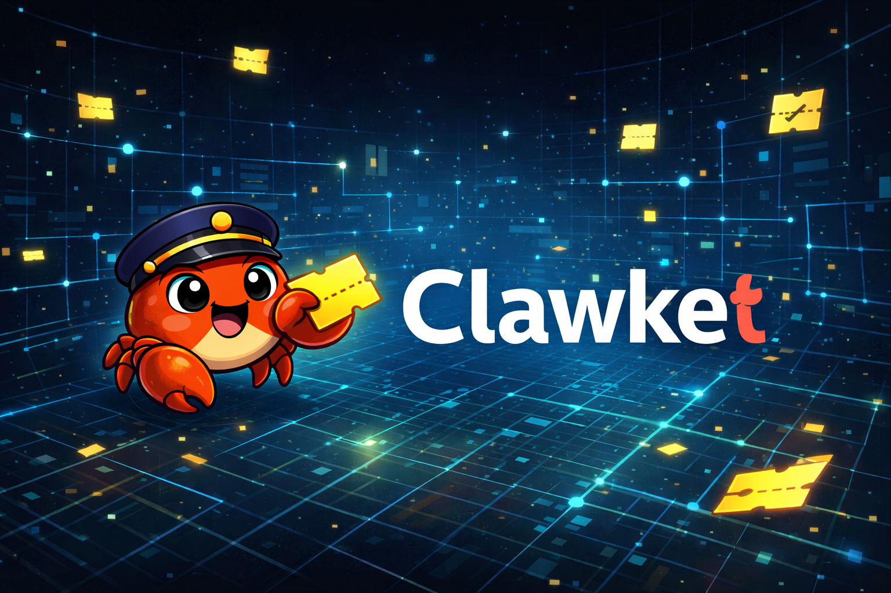
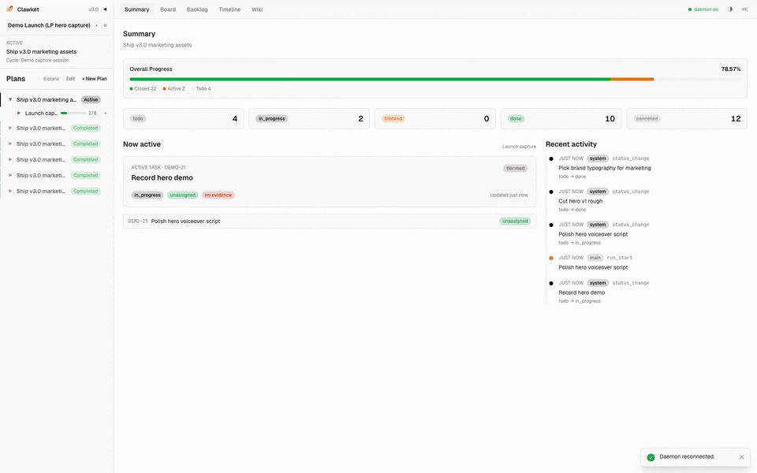
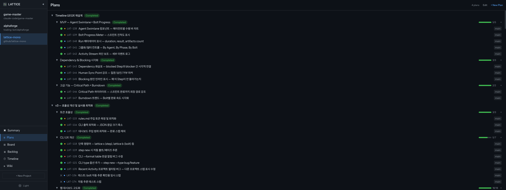
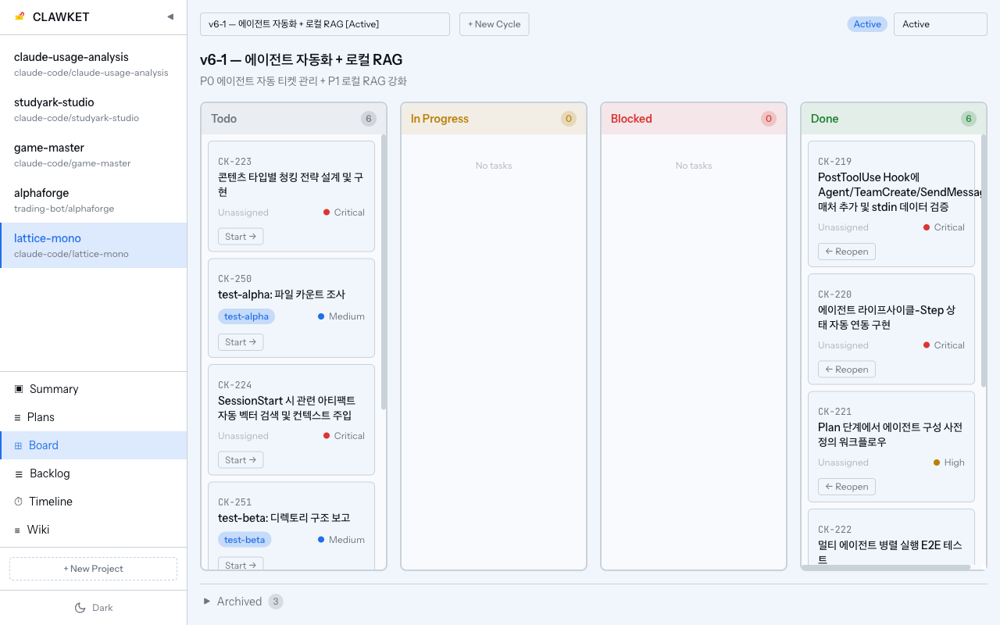
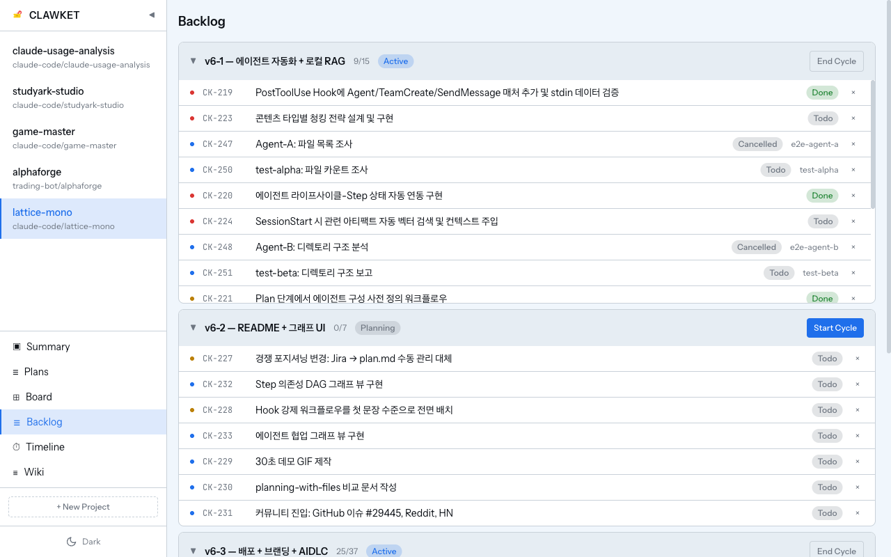
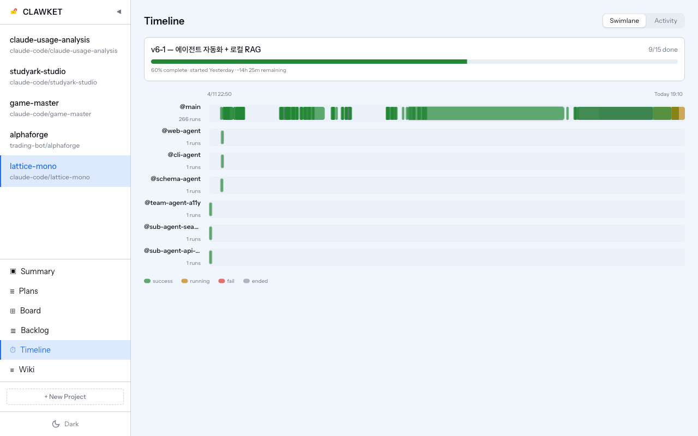
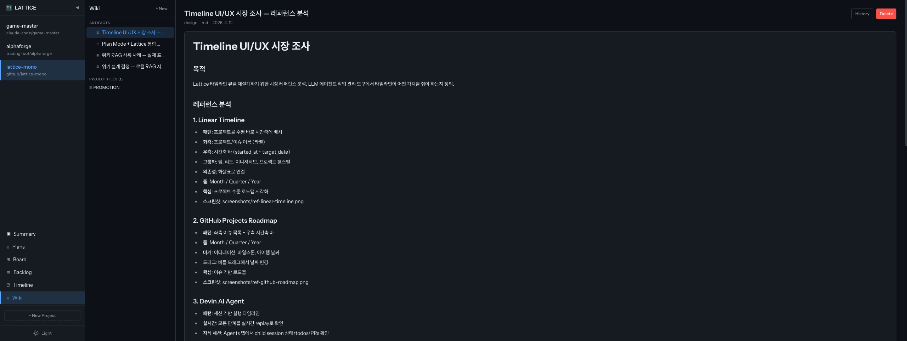

[English](README.md)

<p align="center">
  
</p>

<p align="center"><a href="https://docs.anthropic.com/en/docs/claude-code">Claude Code</a>용 LLM 네이티브 작업 관리 플러그인</p>

Clawket은 LLM 기반 개발을 위한 구조화된 상태 레이어로, Jira + Confluence를 대체합니다. 프로젝트 계획, 유닛, 태스크, 산출물, 실행 이력을 로컬 SQLite 데이터베이스와 경량 데몬을 통해 세션 간 영구 보존합니다. 훅 기반 가드레일이 Claude가 등록된 태스크 없이 작업하지 못하게 보장합니다 — 모든 작업이 추적되고, 모든 세션이 컨텍스트를 가집니다.

## 왜 Clawket인가

구조화된 상태 레이어 없이 Claude Code 세션은 무상태(stateless)입니다:

- **컨텍스트 소실** — 세션이 바뀌면 처음부터 시작. "어디까지 했더라?"에 답이 없음.
- **작업 미추적** — Claude가 뭘 바꿨는지, 언제, 왜 바꿨는지 기록 없음.
- **플랜 노후화** — Plan Mode 파일이 `~/.claude/plans/`에 방치됨.
- **서브에이전트 단절** — 병렬 에이전트가 프로젝트 상태를 공유하지 못함.

Clawket은 영구 데이터베이스, 6개 라이프사이클 훅, 웹 대시보드로 이 문제를 해결합니다 — 모두 로컬 실행.

## 주요 기능

- **구조화된 워크플로우** — Project → Plan (approve) → Unit → Task → Cycle (activate)
- **라이프사이클 훅** — 8개 훅 이벤트로 전체 작업 라이프사이클 자동 추적
- **웹 대시보드** — 요약, 계획, 보드(칸반), 백로그, 타임라인, 위키 6개 뷰
- **에이전트 Swimlane 타임라인** — 에이전트별 수평 바 차트로 동시 작업 시각화
- **드래그 앤 드롭** — 칸반 DnD로 상태 변경, 백로그 DnD로 사이클 배정
- **위키** — 폴더 기반 트리 내비게이션, 설정 가능한 경로, Artifact 버전 관리, 하이브리드 검색 (FTS5 + sqlite-vec)
- **훅 가드레일** — 활성 태스크 없이 작업 불가, 세션마다 프로젝트 컨텍스트 자동 주입
- **티켓 번호** — 내부 ULID와 함께 사람이 읽을 수 있는 ID (CK-1, CK-2) + 토큰 최적화
- **CLI + Web** — LLM(CLI)과 사람(웹 UI) 모두 모든 엔티티 관리 가능

## 아키텍처

```
Claude Code ──(훅)──→ clawketd (Node.js 데몬)
           ──(CLI/Bash)─→ clawket (Rust 바이너리)
                              │
                              ▼
                     ~/.local/share/clawket/db.sqlite

웹 대시보드 (React) ──→ clawketd HTTP API
```

- **clawket** — Rust CLI (~10ms 콜드 스타트). 모든 작업을 하나의 바이너리로.
- **clawketd** — Node.js + Hono HTTP 데몬. 백그라운드에서 Unix 소켓 + TCP로 실행.
- **훅** — SessionStart 시 데몬 자동 시작 및 프로젝트 컨텍스트 주입. PreToolUse로 태스크 등록 강제. PostToolUse로 파일 변경 기록. Stop 훅으로 실행 종료.
- **스킬** — `/clawket` 스킬로 LLM에 명령어 레퍼런스 제공.

## 설치

```bash
# 1. 마켓플레이스 추가
/plugin marketplace add Seungwoo321/clawket

# 2. 플러그인 설치
/plugin install clawket@Seungwoo321-clawket
```

또는 로컬 개발 시:

```bash
claude --plugin-dir /path/to/clawket
```

setup 스크립트가 첫 설치 시 XDG 디렉토리를 자동 생성합니다.

### 사전 요구사항

- [Claude Code](https://docs.anthropic.com/en/docs/claude-code) CLI
- Node.js 20+
- Rust 툴체인 (소스에서 CLI 빌드 시 필요, 또는 사전 빌드된 바이너리 사용)

## 엔티티 계층 구조

```
프로젝트 → 계획(Plan) → 유닛(Unit) → 태스크(Task)
                  │                     ├── 산출물(Artifact) — 문서, 결정, 와이어프레임
                  │                     ├── 실행(Run) — 에이전트/세션별 실행 기록
                  │                     ├── 코멘트(TaskComment) — 토론
                  │                     ├── depends_on — 태스크 의존성
                  │                     └── parent_task_id — 무제한 깊이 계층
                  │
                  └── 사이클(Cycle) — 스프린트/이터레이션 사이클
```

| 엔티티 | 용도 |
|--------|------|
| **Project** | 논리적 프로젝트 ID, 1개 이상의 작업 디렉토리에 매핑 |
| **Plan** | 상위 계획 (Claude Code 플랜 모드에서 가져오기) |
| **Unit** | 작업 그룹 (마일스톤), 승인 게이트 지원 |
| **Task** | 원자적 작업 단위 — 우선순위, 복잡도, 티켓 번호 포함 "티켓" |
| **Cycle** | 스프린트/이터레이션 사이클 — 작업을 시간 제한된 그룹으로 묶음 |
| **Artifact** | Task/Unit/Plan에 첨부된 산출물 (마크다운, YAML, JSON) + 버전 관리 |
| **Run** | 실행 기록 — 어떤 에이전트가 어떤 작업을, 언제 수행했는지 |
| **Question** | 의사결정 포인트 — LLM 또는 사람이 질문, 비동기로 답변 |
| **TaskComment** | 태스크 내 토론 스레드 |

## 훅

Clawket은 다음 Claude Code 훅을 설치합니다:

| 훅 | 트리거 | 용도 |
|----|--------|------|
| **SessionStart** | 세션 시작 | 데몬 시작 보장, 대시보드 컨텍스트 + 규칙 주입 |
| **UserPromptSubmit** | 사용자 메시지마다 | 활성 태스크 컨텍스트 주입, 활성 태스크 없으면 경고 |
| **PreToolUse** | Agent/Edit/Write/Bash 전 | 활성 태스크 없으면 변경 작업 차단 |
| **PostToolUse** | Edit/Write 후 | 파일 변경 사항을 활성 태스크에 기록 |
| **PostToolUse** | ExitPlanMode 후 | Plan Mode 출력을 Clawket에 등록하도록 안내 |
| **SubagentStart** | 서브에이전트 시작 | 에이전트를 배정된 Clawket 태스크에 바인딩 |
| **SubagentStop** | 서브에이전트 종료 | 결과 요약 추가, 태스크 자동 완료 |
| **Stop** | 세션 종료 | 해당 세션의 모든 활성 실행(Run) 종료 |

태스크가 done/cancelled 상태로 전환되면, 데몬이 자동으로 Unit/Plan/Cycle 완료 상태를 cascade 처리합니다.

## 빠른 시작

```bash
# 데몬 상태 확인
clawket daemon status

# 프로젝트 대시보드 조회
clawket dashboard --cwd .

# 대시보드 필터
clawket dashboard --cwd . --show active   # 활성 태스크만
clawket dashboard --cwd . --show all      # 전체

# 태스크 목록 조회
clawket task list --unit-id UNIT-xxx

# 태스크 상태 변경
clawket task update TASK-xxx --status in_progress

# 태스크 검색
clawket task search "migration"

# 새 태스크 생성
clawket task create "인증 버그 수정" --assignee main --body "설명"
# --unit, --cycle 생략 시 현재 프로젝트에서 자동 추론

# 단축 명령어
clawket t list --unit-id UNIT-xxx          # t = task
clawket cy list --project-id PROJ-xxx      # cy = cycle
clawket u list --plan-id PLAN-xxx          # u = unit

# 태스크 본문 추가
clawket task append-body TASK-xxx --text "추가 메모"

# 실행 추적
clawket run start --task TASK-xxx --agent my-agent
clawket run finish RUN-xxx --result success --notes "완료"

# 사이클 (스프린트) 관리
clawket cycle list --project-id PROJ-xxx
clawket cycle create "Sprint 1" --project PROJ-xxx
clawket cycle activate CYC-xxx
```

## 웹 대시보드

웹 대시보드는 6개 뷰를 제공합니다:

| 뷰 | 설명 |
|----|------|
| **요약** | 프로젝트 전체 현황 — 진행률, 활성 에이전트, 유닛 상태 |
| **계획** | 트리 뷰 — 인라인 편집, 일괄 액션, 체크박스 선택 |
| **보드** | 칸반 보드 — 드래그 앤 드롭 상태 변경 |
| **백로그** | 사이클별 그룹화 — 드래그 앤 드롭 배정 |
| **타임라인** | 에이전트 Swimlane 뷰 (Run 바 차트) + 활동 스트림 탭 |
| **위키** | 파일 트리 (heading 자동 추출), Artifact CRUD, GFM 테이블 지원 |

데몬 실행 중 `http://localhost:19400`에서 접근할 수 있습니다.

### 스크린샷

| 요약 | 계획 |
|------|------|
|  |  |

| 보드 (칸반) | 백로그 |
|-------------|--------|
|  |  |

| 타임라인 | 위키 |
|----------|------|
|  |  |

## 설계 원칙

1. **이중 소비자 저장소** — 하나의 저장소, 두 개의 뷰. LLM은 CLI로, 사람은 웹 대시보드로 조회. LLM이 웹 DOM을 직접 조작하지 않음.
2. **구조화된 포맷만** — JSON/YAML/마크다운 프론트매터. 쓰기 경로에 LLM 요약 없음. sqlite-vec 벡터 검색 지원.
3. **상태 레이어** — 저장소 + API만 제공. 비즈니스 로직 없음. 하네스 로직은 Claude Code에 유지.
4. **Task 단위 격리** — 서브에이전트 위임 단위는 Task(세션 아님).
5. **캐시 우선** — Task body는 append-only. 가변 필드(status, assignee)는 꼬리에 배치하여 프롬프트 캐시 프리픽스 보존.
6. **자동 주입 없음** — 새 세션은 깨끗하게 시작. 과거 컨텍스트는 명시적 쿼리로만.

## 데이터 저장 경로 (XDG)

| 경로 | 용도 |
|------|------|
| `~/.local/share/clawket/` | SQLite 데이터베이스 |
| `~/.cache/clawket/` | 소켓, PID, 포트 파일 |
| `~/.config/clawket/` | 설정 |
| `~/.local/state/clawket/` | 로그 |

모든 경로는 `CLAWKET_{DATA,CACHE,CONFIG,STATE}_DIR` 환경변수로 오버라이드 가능.

## 사용법

Clawket은 구조화된 워크플로우를 강제합니다. 프로젝트, 플랜, 태스크가 등록되어 있어야 작업을 시작할 수 있습니다. PreToolUse 훅이 활성 태스크 없이 모든 변경 작업(Edit, Write, Bash, Agent)을 차단합니다.

### 처음 시작하기

새 디렉토리에서 먼저 프로젝트를 등록해야 합니다:

```
사용자: "이 디렉토리를 새 프로젝트로 등록해줘"

→ Claude가 실행: clawket project create "my-project" --cwd "."
→ 웹 대시보드 사이드바에 프로젝트 표시
```

### 작업 계획

Clawket이 플랜의 source of truth입니다 — Claude의 Plan Mode 파일(`~/.claude/plans/`)이 아닙니다. 이것은 의도된 설계입니다: 플랜은 Clawket DB에 보관되며, 로컬 파일로 관리하지 않아 파일 오염이나 동기화 문제가 없습니다.

**일반 모드:**

```
사용자: "인증 리팩토링 계획 세워줘"

→ Claude가 코드베이스 분석 후 대화에서 플랜 제안
→ 사용자가 검토/승인
→ Claude가 CLI로 등록:
  clawket plan create --project PROJ-xxx "인증 리팩토링"
  clawket plan approve PLAN-xxx
  clawket unit create --plan PLAN-xxx "Unit 1 — OAuth 설정"
  clawket task create "OAuth 흐름 구현" --unit UNIT-xxx --assignee main
  clawket cycle create --project PROJ-xxx "Sprint 1"
  clawket cycle activate CYC-xxx
  clawket task update TASK-xxx --cycle CYC-xxx
```

**플랜 모드 (`/plan`):**

```
사용자: /plan
사용자: "인증 리팩토링 계획 세워줘"

→ Claude가 대화 컨텍스트로 플랜 제안 (Write가 훅에 의해 차단됨)
→ 사용자가 ExitPlanMode로 승인
→ Claude가 승인된 내용을 클라켓 CLI로 등록
```

### 새 작업 시작

```
사용자: "설정 페이지 로그인 버그 수정해줘"

→ Claude가 기존 plan/unit/cycle 하위에 태스크 등록
→ in_progress로 전환, 작업 수행, done 처리
  (PreToolUse 훅이 태스크 없이 작업하는 것을 차단)
```

### 핵심 개념

| 개념 | 설명 |
|------|------|
| **Project** | Clawket에 등록된 작업 디렉토리 |
| **Plan** | 상위 의도 (로드맵). CLI로 생성, Plan Mode 파일 아님 |
| **Unit** | 플랜 내 에픽 단위 그룹 (상태 없음, 순수 그룹핑) |
| **Cycle** | 스프린트 — 시간 제한된 이터레이션 사이클 |
| **Task** | 원자적 작업 단위. 작업 시작 전 반드시 존재해야 함 |
| **Backlog** | 사이클 미배정 태스크. 드래그하여 사이클에 배정 |

### 프로젝트 비활성화

데이터를 유지하면서 클라켓 관리를 일시적으로 해제할 수 있습니다. 웹 대시보드에서 **Project Settings → Clawket Management** 토글을 끄면 됩니다.

비활성 시:
- 훅이 해당 디렉토리를 프로젝트 미등록 상태로 인식 — Claude가 제약 없이 동작
- 기존 데이터(플랜, 태스크, 실행 기록)는 모두 보존
- 언제든 다시 켜면 구조화된 워크플로우 재개

### 프롬프트 팁

| 하고 싶은 것 | 이렇게 말하세요 |
|-------------|---------------|
| 프로젝트 등록 | "이 디렉토리를 새 프로젝트로 등록해줘" |
| 작업 계획 | "X 기능 플랜 세우고 클라켓에 등록해줘" |
| 작업 생성 | "X에 대한 태스크 등록하고 작업 시작해" |
| 상태 확인 | "현재 사이클 진행 상황 보여줘" |
| 작업 리뷰 | "지난 스프린트에서 뭘 했어?" |
| 문서 검색 | "위키에서 인증 설계 검색해" |
| 작업 완료 | "현재 태스크 완료 처리해" |

## Lattice에서 마이그레이션

Lattice v1.x에서 업그레이드하는 경우, 데몬이 첫 시작 시 자동으로 데이터베이스를 마이그레이션합니다:
- `~/.local/share/lattice/db.sqlite` → `~/.local/share/clawket/db.sqlite`
- 스키마 마이그레이션 017이 모든 엔티티를 리네이밍 (Phase→Unit, Step→Task, Bolt→Cycle)
- ID 접두사 변경: `PHASE-`→`UNIT-`, `STEP-`→`TASK-`, `BOLT-`→`CYC-`, `LAT-`→`CK-`

## 개발

```bash
# Daemon
cd daemon && pnpm install

# Web dashboard
cd web && pnpm install && pnpm dev

# CLI
cd cli && cargo build
```

## 라이선스

MIT
