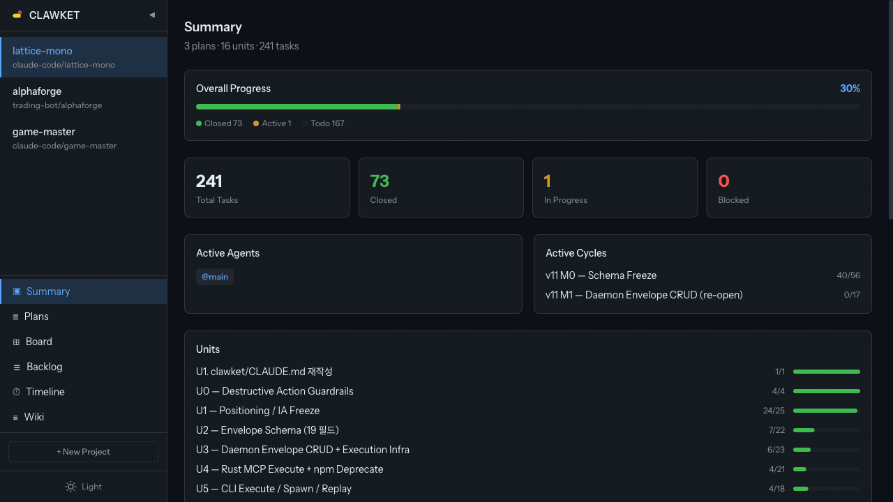

[한국어](README.ko.md)

<p align="center">
  
</p>

<p align="center">Structured task contracts for LLM coding agents.</p>

<p align="center">
  
</p>

Clawket is a structured state layer that replaces Jira + Confluence for LLM-driven development. It persists project plans, units, tasks, knowledge, and execution history across sessions via a local SQLite database and a lightweight daemon. Hook-based guardrails ensure the agent never works without a registered task — every action is tracked, every session has context.

On top of the state layer, Clawket ships a **local RAG stack** (sqlite-vec + on-device embeddings) and an **MCP stdio server** (embedded in the CLI binary via rmcp 1.5) that lets Claude Code pull semantic context across sessions without shipping anything to an external vector DB.

## Why Clawket

Without structured state, Claude Code sessions are stateless:

- **Context vanishes** — Each session starts from scratch. "Where was I?" has no answer.
- **Work goes untracked** — No record of what the agent changed, when, or why.
- **Plans become stale** — Plan Mode files sit in `~/.claude/plans/` and rot.
- **Sub-agents are blind** — Parallel agents have no shared visibility into project state.
- **Past decisions vanish** — Previous design rationale can't be recalled by the next session.

Clawket fixes this with a persistent database, local vector RAG, an MCP pull interface, runtime adapters, and a web dashboard — all running locally.

## Features

- **Structured Workflow** — Project → Plan (approve) → Unit → Cycle (`--unit` required, then activate) → Task
- **Lifecycle Hooks** — 6 Claude Code events + `PostToolUse:ExitPlanMode` matcher wired to dedicated handlers (SessionStart, UserPromptSubmit, PreToolUse, PostToolUse, SubagentStart, SubagentStop)
- **Web Dashboard** — Summary, Plans, Board (Kanban), Backlog, Timeline, Wiki — 6 views
- **Agent Swimlane Timeline** — Per-agent horizontal bar chart with concurrent work visualization
- **Drag & Drop** — Kanban DnD for status changes, backlog DnD for cycle assignment
- **Wiki + Local RAG** — File-tree navigation, knowledge versioning, hybrid search (FTS5 keyword + sqlite-vec semantic) over knowledge entries
- **Auto-Embedding** — Knowledge entries and all tasks are embedded on create/update using on-device `paraphrase-multilingual-MiniLM-L12-v2` (384d, 50+ languages). Missing embeddings are backfilled at daemon startup.
- **MCP RAG Pull** — `clawket mcp` (stdio server embedded in the CLI binary) exposes 5 read-only tools for Claude Code's tool_use over knowledge.
- **Hook Guardrails** — Blocks work without active task, injects project context per session
- **Ticket Numbers** — Human-readable IDs (CK-1, CK-2) with token-optimized output
- **CLI + Web** — Both LLM (CLI) and human (web UI) manage the same state

### Claude Hooks

A literal projection of [`hooks/hooks.json`](hooks/hooks.json) — 6 event types + the `PostToolUse:ExitPlanMode` matcher branch.

| Event | Matcher | Handler | What it does |
|---|---|---|---|
| **SessionStart** | `startup\|clear\|compact` | `session-start.cjs` | Ensures the daemon is running, injects the project dashboard + rules, and runs the install gate. |
| **UserPromptSubmit** | (all) | `user-prompt-submit.cjs` | Injects active-task context, warns when no active task is set. |
| **PreToolUse** | `Agent\|TeamCreate\|SendMessage\|Edit\|Write\|Bash` | `pre-tool-use.cjs` | Blocks mutating tools unless an active task exists; runs PDD anti-pattern checks (X3/X7/X8/X9). |
| **PostToolUse** | `Edit\|Write` | `post-tool-use.cjs` | Records file modifications to the active task; runs the X3 scenario-id check. |
| **PostToolUse** | `ExitPlanMode` | `plan-sync.cjs` | Prompts the agent to register the Plan Mode output as a Clawket plan. Routed via the `ExitPlanMode` tool matcher because Claude Code classifies plan-mode exit as a tool invocation, not a standalone hook event. |
| **SubagentStart** | (all) | `subagent-start.cjs` | Binds the spawned sub-agent to its assigned task; runs X3/X7/X9 checks. |
| **SubagentStop** | (all) | `subagent-stop.cjs` | Appends the result summary, runs the X8 evidence check, and auto-completes the task on success. |

When a task transitions to `done`/`cancelled`, the daemon auto-cascades completion to Unit, Plan, and Cycle if all their children are terminal — no separate hook is required.

### Stack

| Layer | Tech |
|---|---|
| CLI | Rust, single static binary (`clawket` / `clawket mcp`) |
| Daemon | Rust (axum + rusqlite), Unix socket + TCP |
| Storage | SQLite + sqlite-vec (vec0 virtual tables) |
| Embeddings | `candle-core` with `paraphrase-multilingual-MiniLM-L12-v2` (384d, on-device) |
| MCP | `rmcp` 1.5 stdio server, embedded in the CLI binary |
| Web | React 19 + Vite + Tailwind + dnd-kit |
| Adapter | Claude Code plugin + hooks + skills + `.mcp.json` |

### Vendor Policy & Tier Routing

Clawket v3 targets the **Claude model family exclusively**. Tasks carry one of three tier labels — `low` (Haiku-class), `med` (Sonnet-class), or `high` (Opus-class) — and the agent spawner routes each task to a model that meets or exceeds the required tier. Downgrading is advisory in v3 (warning only) and will be hard-enforced in v4+ alongside a vendor-agnostic adapter layer.

Full semantics and routing table: [docs/VENDOR_POLICY.md](docs/VENDOR_POLICY.md).

### Bundled Skills & Slash Commands

The plugin registers 7 skills (see `.claude-plugin/plugin.json::skillsList`) and 7 slash commands (`plugin.json::commands`):

| Skill | Slash command | Purpose |
|---|---|---|
| `clawket` | (no slash) | Read/update tasks, plans, units, cycles via the dashboard surface. |
| `pdd` | `/pdd-plan`, `/pdd-promote` | PDD Plan + Unit pre-design (`/pdd-plan`); promote EXPERIMENTAL → STABLE skill RULE.md (`/pdd-promote`, manual confirmation gate). |
| `scenario-author` | `/scenario-author` | Author atomic user scenarios (Given/When/Then) for a domain. Phase 0 of the discover-loop. |
| `qa-batch` | `/qa-batch` | Sub-agent batch dispatch + TSV evidence + bulk sync transcription. PDD A8 operational interface. |
| `discover-loop` | `/discover-loop` | Discover-converge main engine — Round R sub-agent dispatch, 3-way convergence judgment, next-round scheduling. |
| `scenario-refine` | `/scenario-refine` | Handle `scenario_error`: atomic decomposition / intent redefinition / deletion 3-way branch. |
| `qa-fix` | `/qa-fix` | QA defect → fix task registration for the next round. |

## Installation

```bash
# 1. Add marketplace
/plugin marketplace add clawket/clawket

# 2. Install plugin
/plugin install clawket@clawket
```

Binaries (`clawket` CLI, `clawketd` daemon, web bundle) are downloaded from GitHub Releases by an idempotent install gate (`adapters/shared/claude-hooks.cjs::ensureInstalled`) that runs at `SessionStart`; subsequent runs are no-ops once version markers match. The embedding model is fetched on first use by the daemon. The MCP stdio server is registered through the plugin's `.mcp.json` as `clawket mcp` (the CLI binary's MCP subcommand).

### Prerequisites

- [Claude Code](https://docs.anthropic.com/en/docs/claude-code) CLI
- Node.js 20+ (setup hook only)
- Rust toolchain is **not** required — the plugin setup downloads prebuilt `clawket` + `clawketd` binaries. Build from source only if you want to develop the CLI or daemon.

## Local RAG

Clawket's RAG lives entirely inside the daemon. Nothing leaves your machine.

### What gets embedded

| Entity | Trigger | Source text |
|---|---|---|
| Task | On create and on any update; missing rows backfilled at daemon startup | `title\nbody` |
| Knowledge | On create and on update **when** `content` is present | `title\ncontent` |

### Vector storage

- `vec_tasks(task_id TEXT PRIMARY KEY, embedding float[384])`
- `vec_knowledge(knowledge_id TEXT PRIMARY KEY, embedding float[384])`

Both are sqlite-vec `vec0` virtual tables. Updates use `DELETE` + `INSERT` because vec0 does not support `INSERT OR REPLACE`.

### Hybrid search

The daemon exposes HTTP endpoints for keyword (FTS5), semantic (KNN over vec0), and hybrid search over tasks and knowledge. The same endpoints are reused by the web Wiki, the CLI `search` subcommands, and the MCP server.

## MCP Server

Clawket ships an MCP stdio server so Claude Code can **pull** context on demand (complementing SessionStart's push injection). It is implemented in Rust via `rmcp` 1.5 and **embedded in the `clawket` CLI binary** — invoked as `clawket mcp` (stdio). It auto-discovers the daemon's port from `~/.cache/clawket/clawketd.port` and calls the daemon's HTTP API. The plugin's `.mcp.json` wires it into Claude Code.

| Tool | Purpose |
|------|---------|
| `clawket_search_knowledge` | Semantic/keyword/hybrid search over knowledge entries |
| `clawket_search_tasks` | Semantic/keyword/hybrid search over tasks |
| `clawket_find_similar_tasks` | KNN neighbors of a seed task, with decisions/issues extracted from comments |
| `clawket_get_task_context` | Task + related knowledge / relations / comments / activity history |
| `clawket_get_recent_decisions` | `type=decision` knowledge entries in reverse chronological order |

Run manually: `clawket mcp` (stdio).

## Architecture

```
Claude Code
  ├─ plugin hooks ──────────────┐
  └─ .mcp.json → stdio child ─┐ │
                              │ │
                              ▼ ▼
                        clawket mcp (rmcp stdio, embedded in CLI)
                              │ (HTTP, port auto-discovery)
                              ▼
                         clawketd (Rust: axum + rusqlite)
                              │   ├─ Unix socket: ~/.cache/clawket/clawketd.sock
                              │   ├─ TCP: http://127.0.0.1:<port>
                              │   ├─ SSE event bus (/events)
                              │   ├─ Auto-embed on POST/PATCH (knowledge)
                              │   └─ Startup backfill (missing vec_tasks)
                              ▼
                        SQLite + sqlite-vec
                      ~/.local/share/clawket/db.sqlite

Web Dashboard (React 19) ──────▶ clawketd HTTP API + SSE
```

### XDG paths

| Path | Purpose | Override |
|---|---|---|
| `~/.local/share/clawket/` | SQLite database | `CLAWKET_DATA_DIR` |
| `~/.cache/clawket/` | Unix socket, pid, port, runtime state | `CLAWKET_CACHE_DIR` |
| `~/.config/clawket/` | Configuration | `CLAWKET_CONFIG_DIR` |
| `~/.local/state/clawket/` | Logs | `CLAWKET_STATE_DIR` |

## Project Structure

This repo is a thin plugin shell. Source for cli / daemon / web / desktop lives
in sibling repos under the `clawket` GitHub org. Setup pulls compiled binaries
(`clawket`, `clawketd`), the web bundle, and (when pinned) the Tauri desktop
installer from GitHub Releases — no Rust toolchain or npm install runs at
plugin install time.

```
clawket/
├── .claude-plugin/          # Claude plugin manifest + marketplace metadata
├── .mcp.json                # Registers `clawket mcp` (stdio) — invokes the `clawket` CLI directly
├── hooks/hooks.json         # Claude hook routing manifest
├── components.json          # Pinned versions of cli / daemon / web / desktop binaries consumed by setup
├── skills/clawket/          # /clawket skill (SKILL.md)
├── prompts/                 # Shared + runtime-specific prompt fragments
├── adapters/
│   ├── shared/              # claude-hooks.cjs — install gate (`ensureInstalled`) + daemon glue
│   └── claude/              # Claude adapter entrypoints (hook .cjs handlers)
├── scripts/
│   └── setup.cjs            # Manual / CI setup entry — delegates to ensureInstalled
├── docs/                    # COMPATIBILITY.md + RELEASING.md + HOOK_ENFORCEMENT.md
├── assets/                  # Logo, mascot, branding
├── screenshots/             # Dashboard screenshots
├── bin/                     # (created by setup) downloaded clawket CLI binary
├── daemon/bin/              # (created by setup) downloaded clawketd binary
├── web/dist/                # (created by setup) extracted web dashboard bundle
└── desktop/dl/              # (created by setup; empty while pin is null) downloaded Tauri installer
```

### Separate repos

| Repo | Content | Consumed as |
|---|---|---|
| [`clawket/cli`](https://github.com/clawket/cli) | Rust CLI + embedded `clawket mcp` (rmcp 1.5) | GitHub Releases binary |
| [`clawket/daemon`](https://github.com/clawket/daemon) | Rust daemon (axum + rusqlite + sqlite-vec + candle-core) | GitHub Releases binary |
| [`clawket/web`](https://github.com/clawket/web) | React dashboard | GitHub Releases tarball |
| [`clawket/desktop`](https://github.com/clawket/desktop) | Tauri 2 desktop app (renders the same SPA as `web`) | GitHub Releases installer (`.dmg` / `.msi` / `.AppImage`) — pinned to `null` in v3.0.0 until first release |
| [`clawket/landing`](https://github.com/clawket/landing) | Public landing page | Vercel |

See `docs/COMPATIBILITY.md` for version range guarantees.

## Web Dashboard

Access at `http://localhost:19400` when the daemon is running. Six views, real-time updates via SSE.

| View | Description |
|------|-------------|
| **Summary** | Project overview with progress, active agents, unit progress |
| **Plans** | Tree view with inline editing, bulk actions, checkbox selection |
| **Board** | Kanban board with drag-and-drop status changes |
| **Backlog** | Cycle-grouped backlog with drag-and-drop cycle assignment |
| **Timeline** | Agent swimlane (run bars per agent) + activity stream tab |
| **Wiki** | File-tree navigation, knowledge CRUD with version history, FTS5 + semantic search, GFM tables |

### Screenshots

| Summary | Plans |
|---------|-------|
|  |  |

| Board (Kanban) | Backlog |
|----------------|---------|
|  |  |

| Timeline | Wiki |
|----------|------|
|  |  |

## Usage

Clawket enforces a structured workflow. The agent cannot start mutating work until a project, an active plan, and an active task all exist. The PreToolUse hook blocks all mutating tools (Edit, Write, Bash, Agent, TeamCreate, SendMessage) until an active task exists.

### First-time setup

Every new directory needs a project registered first:

```
You: "Register this as a new project"

→ Agent runs: clawket project create "my-project" --cwd "."
→ Project appears in the web dashboard sidebar
```

### Planning work

Clawket is the source of truth for plans — not Claude's Plan Mode files (`~/.claude/plans/`). Plans live in the Clawket database, not as local files that can become stale. The agent proposes plans in conversation, and after approval registers them via CLI.

**Normal mode:**

```
You: "Plan the authentication refactor"

→ Agent analyzes the codebase and proposes a plan in chat
→ You review and approve
→ Agent registers via CLI:
  clawket plan create --project PROJ-xxx "Auth Refactor"
  clawket plan approve PLAN-xxx
  clawket unit create --plan PLAN-xxx "Unit 1 — OAuth Setup"
  clawket cycle create --project PROJ-xxx --unit UNIT-xxx "Sprint 1"
  clawket cycle activate CYC-xxx
  clawket task create "Implement OAuth flow" --cycle CYC-xxx
```

**Plan mode (`/plan`):**

```
You: /plan
You: "Plan the authentication refactor"

→ Agent proposes the plan as conversation context (Write is blocked by hooks)
→ You approve via ExitPlanMode
→ Agent registers the approved plan in Clawket via CLI
```

### Working on tasks

```
You: "Fix the login bug on the settings page"

→ Agent registers a task under an existing plan/unit/cycle
→ Sets it to in_progress, works on it, marks it done
  (PreToolUse hook blocks work until a task exists)
```

### Retrieving past context (MCP pull)

```
You: "Find any past decisions about auth retry policy"

→ Agent calls clawket_search_knowledge / clawket_get_recent_decisions
→ Returns knowledge entries with semantic relevance
```

### Reviewing in the web dashboard

Open `http://localhost:19400` to see Board (current sprint), Backlog, Timeline (agent swimlane), and Wiki (knowledge entries).

### Key concepts

| Concept | Description |
|---------|-------------|
| **Project** | A working directory registered with Clawket |
| **Plan** | High-level intent (roadmap). Must be approved before tasks can start |
| **Unit** | Pure grouping entity (no status). Organizes tasks within a plan |
| **Task** | Atomic task unit. Can be created without a cycle (goes to backlog) |
| **Cycle** | Sprint — time-boxed iteration. Tasks must be assigned to an active cycle to start |
| **Knowledge** | Attached document with versioning. Embedded for hybrid search and exposed to LLM. |
| **Backlog** | Tasks without a cycle assignment. Drag to a cycle to schedule |

### State management

- **Plan**: `draft` → `active` (intentional approve) → `completed` (intentional end)
- **Unit**: No status — pure grouping
- **Cycle**: `planning` → `active` (intentional start) → `completed` (intentional end). Cannot be restarted.
- **Task**: `todo` → `in_progress` → `done`/`cancelled`. Requires active plan + active cycle to start. `blocked` is also valid.

### Disabling Clawket for a project

In the web dashboard, go to **Project Settings** and toggle **Clawket Management** off. Hooks then treat the directory as unregistered — the agent works without constraints, all existing data is preserved, and you can re-enable any time.

### Prompt tips

| What you want | What to say |
|---------------|-------------|
| Register project | "Register this directory as a new project" |
| Plan work | "Plan feature X — propose a plan and register it in Clawket" |
| Create a task | "Register a task for X and start working" |
| Check status | "Show me the current cycle progress" |
| Review work | "What was done in the last sprint?" |
| Search past decisions | "Search the wiki for authentication design decisions" |
| Finish up | "Mark the current task as done" |

## Development

Each component lives in its own repo under the `clawket` org.

```bash
# CLI (+ embedded MCP)
cd cli && cargo build --release
./target/release/clawket mcp    # run embedded MCP stdio locally

# Daemon
cd daemon && cargo build --release
./target/release/clawketd

# Web dashboard
cd web && pnpm install && pnpm dev
```

### Local dev override (testing before publish)

When validating a local build before pushing it through the marketplace, repoint the user-level binary at the dev build outputs so every entry point — shell, Claude Code hooks, MCP launcher — resolves the dev binary. The marketplace install creates `~/.local/bin/clawket -> "$CLAUDE_PLUGIN_ROOT/bin/clawket"` (the plugin root resolves to `~/.claude/plugins/cache/clawket` when Claude Code does not set the env var explicitly); replace that link with the freshly built dev binary:

```bash
# from this repo root (clawket/)
ln -sf "$(pwd)/cli/target/release/clawket"    ~/.local/bin/clawket
ln -sf "$(pwd)/daemon/target/release/clawketd" ~/.local/bin/clawketd
hash -r                # drop shell command cache so PATH lookup resolves the new symlink
clawket --version      # expect the dev version
clawket doctor         # confirm dev binaries are resolved
```

In `clawket doctor`, confirm that:

- `[Daemon] binary: ~/.local/bin/clawketd (PATH)`
- `[MCP] clawket mcp launcher: ~/.local/bin/clawket`
- `[Plugin install] binary_version: <your dev version>`

The override does not touch user data — `~/.local/share/clawket/`, `~/.cache/clawket/`, etc. stay shared between dev and marketplace binaries, so plans/tasks/SQLite carry over both ways. The `LM-8` path-separation invariant continues to hold.

Restore the marketplace binary when finished testing:

```bash
ln -sf "${CLAUDE_PLUGIN_ROOT:-$HOME/.claude/plugins/cache/clawket}/bin/clawket" ~/.local/bin/clawket
rm -f  ~/.local/bin/clawketd
hash -r
clawket --version      # back to the published version
```

If the marketplace symlink target is missing on your machine, run `/plugin update clawket@clawket` (or `/plugin uninstall clawket@clawket && /plugin install clawket@clawket`) inside Claude Code to recreate it.

## Privacy

> Clawket is **local-first**. No data leaves your machine by default.

All project state — tasks, plans, knowledge, activity logs — is stored in a local SQLite database (`~/.local/share/clawket/db.sqlite`). The daemon listens only on loopback (default port `19400`, auto-incrementing if the port is busy) and a Unix domain socket; it makes no outbound network requests.

The embedding model (`paraphrase-multilingual-MiniLM-L12-v2` via `candle-core`) runs entirely on-device. No data is sent to any external API or vector service.

Full details: [PRIVACY.md](PRIVACY.md).

## Telemetry

Clawket records **no remote telemetry**. The only observability data it writes is the local activity log, stored in the SQLite database under the `activity_log` table. This table captures:

| Field | Description |
|-------|-------------|
| `event_type` | Action taken (e.g. `task.start`, `file.edit`, `hook.pre_tool_use`) |
| `entity_id` | ID of the affected entity (task, knowledge, plan, etc.) |
| `actor` | `"agent"` or `"user"` |
| `session_id` | Local session identifier |
| `ts` | Timestamp (UTC) |
| `detail` | Optional JSON payload (e.g. file path, old/new status) |

To inspect activity:

```bash
clawket watch                       # live SSE stream of task/cycle/run events
clawket watch --task TASK-xxx       # filter by task
clawket replay TASK-xxx             # replay the run history of a task
```

For raw historical rows, query `activity_log` in the SQLite DB directly (`sqlite3 ~/.local/share/clawket/db.sqlite`). Nothing in this log is ever transmitted outside your machine.

## Contributing

> *Decompose, contract, execute — the structured agent loop.*

Every contribution moves through three steps, in order: **decompose** the work into a task tree, **sign each leaf with a contract** (the 19-field execution envelope), then **execute against the contract**. The `PreToolUse` hook hard-blocks step 3 if steps 1–2 weren't done — there is no flag to skip it. The correct response to a block is to go back and finish the contract.

Full guide: [docs/CONTRIBUTING.md](docs/CONTRIBUTING.md).

## License

MIT
